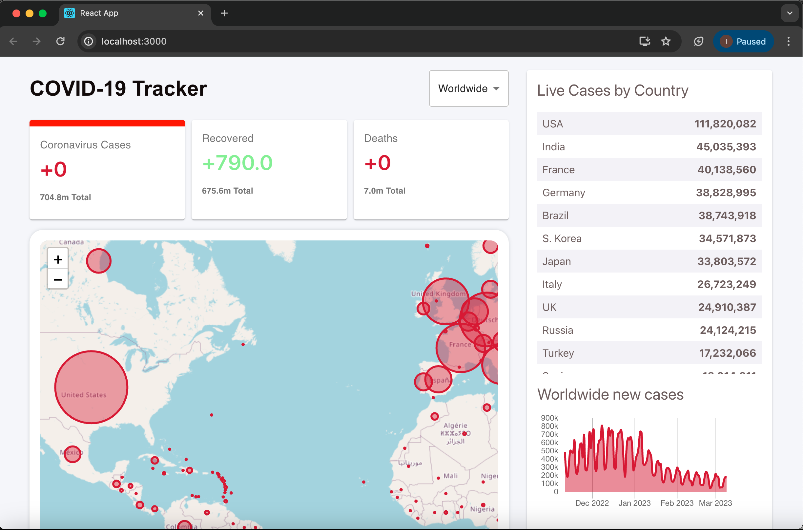

# Covid-19 Tracker

This project is a React-based web application that tracks Covid-19 statistics globally. It uses React, Leaflet for maps, and various other libraries to display real-time data about Covid-19 cases, recoveries, and deaths.

## Demo

Check out the website below:

## Features

- Real-time Covid-19 statistics
- Interactive map displaying cases, recoveries, and deaths by country
- Data visualization with charts
- Country-wise data filtering
- Responsive design

## Usage

- **Viewing Global Data:** The homepage shows global statistics for Covid-19.
- **Interactive Map:** Use the map to explore data for different countries.
- **Charts:** View graphical representations of Covid-19 data.
- **Country Filtering:** Filter data by country to see specific statistics.

## Technologies Used

- **React:** Frontend library for building user interfaces.
- **Leaflet:** Library for interactive maps.
- **Chart.js:** Library for data visualization.
- **Material-UI:** React components for faster and easier web development.
- **Axios:** Promise-based HTTP client for the browser and Node.js.
- **Firebase:** Backend-as-a-Service for real-time database and hosting.

